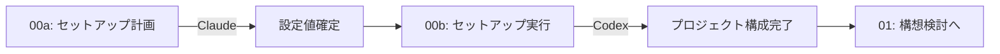
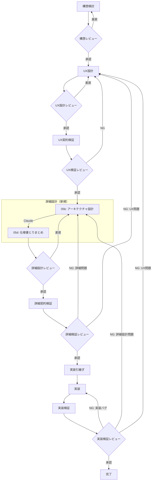
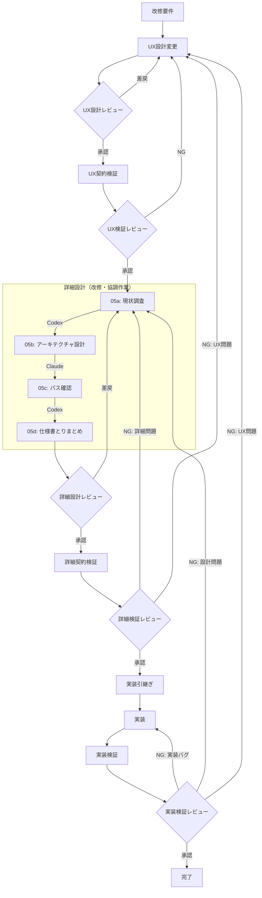

# 開発フロー検討資料

**作成日**: 2026-01-31
**ステータス**: 検討中

---

## 0. プロジェクトセットアップ

### 0.1 概要

新規プロジェクト開始時に、開発フレームワークを導入するフェーズ。

### 0.2 セットアップフロー



### 0.3 フレームワーク配布方式

| 方式 | 説明 |
|------|------|
| git submodule | `dev/` をサブモジュールとして追加 |
| 変更不可 | フレームワーク内のファイルは編集禁止 |
| 更新 | `git submodule update --remote` で最新化 |

### 0.4 プロジェクト構成

```
project/
├── dev/                      ← サブモジュール（変更不可）
│   ├── AGENTS.md             # AI行動規範
│   ├── prompt/               # プロンプトテンプレート群
│   └── project-config.yml.template
├── docs/
│   ├── ux/                   # UX仕様書
│   └── detail/               # 詳細仕様書
├── src/                      # 実装
├── tests/                    # テスト
├── project-config.yml        # プロジェクト固有設定（.gitignore対象）
└── .gitmodules
```

### 0.5 設定ファイル（project-config.yml）

各プロンプトで使用する変数を一元管理：

| 変数 | 設定箇所 | 例 |
|------|----------|-----|
| `{{SPEC_DIR}}` | directories.ux_spec | docs/ux |
| `{{IMPL_DIR}}` | directories.impl | src |
| `{{DESIGN_ROLE}}` | roles.design | Designer |
| `{{IMPL_ROLE}}` | roles.impl | Developer |

### 0.6 clone 時の注意

```bash
# サブモジュールを含めて clone
git clone --recursive [リポジトリURL]

# または clone 後に取得
git submodule update --init --recursive
```

---

## 1. 新規開発フロー（UX重点開発）

### 1.1 フェーズ一覧

| # | フェーズ | 担当 | 成果物 | 適任 | 理由 |
|---|----------|------|--------|------|------|
| 1 | 構想検討 | PO/設計 | 要件概要 | Claude | 抽象的要件の整理、ステークホルダー視点の理解 |
| 1R | 構想レビュー | **人間** | 承認/指摘 | - | 人間による成果物確認・承認 |
| 2 | UX設計 | 設計 | UX仕様書 | Claude | ユーザー体験の言語化、画面構成の論理的整理 |
| 2R | UX設計レビュー | **人間** | 承認/指摘 | - | 人間による成果物確認・承認 |
| 3 | UX契約検証 | 検証 | 検証結果 | Claude | 矛盾・曖昧さの検出、論理的整合性チェック |
| 3R | UX検証レビュー | **人間** | 承認/指摘 | - | 人間による検証結果確認・承認 |
| 4 | 詳細設計 | 設計 | 詳細仕様書、契約書 | 下記※ | 新規: Claude単独 / 改修: 協調作業 |
| 4R | 詳細設計レビュー | **人間** | 承認/指摘 | - | 人間による成果物確認・承認 |
| 5 | 詳細契約検証 | 検証 | 検証結果 | Claude | 形式的な検証、網羅性チェック |
| 5R | 詳細検証レビュー | **人間** | 承認/指摘 | - | 人間による検証結果確認・承認 |
| 6 | 実装引継ぎ | 設計→実装 | 実装依頼書 | Claude | 資料整理、抽象化された情報の伝達 |
| 7 | 実装 | 実装 | コード | Codex | コード生成、ファイル操作に特化 |
| 8 | 実装検証 | 検証 | 検証結果 | Codex | テスト実行、動作確認、デバッグ |
| 8R | 実装検証レビュー | **人間** | 承認/指摘 | - | 人間による検証結果確認・承認 |

※ **詳細設計の担当分担**:
- **新規開発**: Claude単独（05b → 05d）
- **改修**: Codex（05a）→ Claude（05b）→ Codex（05c）→ Claude（05d）

### 1.2 新規開発時の詳細設計

新規開発時は既存コードがないため、**現状調査（05a）とパス確認（05c）は不要**。

| サブフェーズ | プロンプト | 担当 | 新規開発時 |
|--------------|------------|------|------------|
| 現状調査 | 05a-detail-survey.md | Codex | **スキップ** |
| アーキテクチャ設計 | 05b-detail-architecture.md | Claude | ○ 実施 |
| パス確認 | 05c-detail-path-confirm.md | Codex | **スキップ** |
| 仕様書とりまとめ | 05d-detail-finalize.md | Claude | ○ 実施 |



### 1.2a 人間レビューフェーズ

各AIフェーズの後に人間によるレビューフェーズが存在する。

#### レビューフロー

```
[レビュー開始]
    ↓
AIが成果物サマリ提示
    ↓
┌─────────────────────────────┐
│ 項目ごとのレビューループ     │
│                             │
│   AI: 項目Nのレビュー依頼    │
│         ↓                   │
│   人間: レビュー・指摘/承認  │
│         ↓                   │
│   ┌─[指摘]─────────────┐    │
│   │ AI: 対応案提示      │    │
│   │       ↓            │    │
│   │ 人間: 選択/承認/棄却│    │
│   │       ↓            │    │
│   │ [承認] → 成果物反映 │    │
│   │ [棄却] → 再提示     │    │
│   └─────────────────────┘    │
│         ↓                   │
│   次の項目へ                 │
└─────────────────────────────┘
    ↓
全項目完了
    ↓
人間: 次ステップ進行 or 再レビュー
```

#### レビュープロンプト一覧

| プロンプト | 対象フェーズ |
|------------|--------------|
| 01r-init-review.md | 構想検討レビュー |
| 02r-ux-review.md | UX設計レビュー |
| 03r-ux-verify-review.md | UX検証レビュー |
| 05r-detail-review.md | 詳細設計レビュー |
| 06r-detail-verify-review.md | 詳細検証レビュー |
| 13r-impl-verify-review.md | 実装検証レビュー |

### 1.3 UX設計と詳細設計の責務分離

| 項目 | UX設計 | 詳細設計 |
|------|--------|----------|
| 定義するもの | **What**（何を作るか） | **How**（どう実現するか） |
| 画面構成 | ○ | - |
| 操作フロー | ○ | - |
| 表示仕様 | ○ | - |
| データ形式 | - | ○ |
| ファイル構造 | - | ○ |
| API仕様 | - | ○ |
| 既存実装との差分 | - | ○ |

### 1.4 詳細設計で定義すべき内容

| カテゴリ | 内容 | 例 |
|----------|------|-----|
| **アーキテクチャ設計** | レイヤー分離、モジュール分割、依存関係 | UI層/Logic層/Data層 |
| データ設計 | ファイル形式、JSONスキーマ | セッションファイルの構造 |
| API設計 | エンドポイント、リクエスト/レスポンス | POST /api/sessions |
| ファイル構造 | ディレクトリ構成、命名規則 | sessions/YYYY-MM-DD-HHmmss-NNN.json |
| 変更対象 | 具体的なファイルパス | src/public/scripts/app.js |
| 差分明示 | Before/After | 現状→変更後の対比 |
| 実装制約 | 禁止事項、変更範囲 | 100行以上の削除禁止 |

### 1.5 アーキテクチャ設計の詳細

#### レイヤー分離

| レイヤー | 責務 | 依存先 |
|----------|------|--------|
| UI層 | 表示・入力処理 | Logic層のみ |
| Logic層 | ビジネスロジック | Data層のみ |
| Data層 | データアクセス | なし |

```
UI → Logic → Data
 ↑      ↑
 ×      × 逆方向の依存禁止
```

#### モジュール分割

| 項目 | 内容 |
|------|------|
| 分割単位 | 機能単位（セッション、メンション等） |
| 責務 | 単一責任（1モジュール1機能） |
| インターフェース | 関数シグネチャを明示 |

#### ディレクトリ構造例

```
src/
├── ui/                    # UI層
│   ├── components/        # UIコンポーネント
│   └── views/             # 画面
├── logic/                 # Logic層
│   ├── session.js         # セッション管理
│   └── mention.js         # メンション処理
├── data/                  # Data層
│   ├── api.js             # サーバー通信
│   └── storage.js         # ローカルストレージ
└── app.js                 # エントリーポイント
```

**アーキテクチャ設計を実装担当に任せてはいけない。**

### 1.6 差し戻しルール

| 検証フェーズ | 差し戻し先 | 条件 |
|--------------|------------|------|
| UX契約検証 | UX設計 | UX仕様の不備・矛盾 |
| 詳細契約検証 | 詳細設計 | 詳細仕様の不備・曖昧さ |
| 詳細契約検証 | UX設計 | UX仕様自体に根本的問題 |
| 実装検証 | 実装 | 実装バグ・コード品質問題 |
| 実装検証 | 詳細設計 | 詳細設計の不備・曖昧さが原因 |
| 実装検証 | UX設計 | UXの根本的問題が原因 |

### 1.7 引継ぎの定義

#### UX設計 → 詳細設計

| 引継ぎ対象 | 内容 |
|------------|------|
| ドキュメント | UX仕様書 |
| コンテキスト | 設計意図、判断理由 |
| 制約 | 禁止事項、前提条件 |

#### 詳細設計 → 実装

| 引継ぎ対象 | 内容 |
|------------|------|
| ドキュメント | 詳細仕様書、契約書、実装依頼書 |
| コンテキスト | 設計意図、判断理由、優先順位 |
| 制約 | 禁止事項、既存コード保護ルール |
| 参照 | 変更対象ファイル、関連コード |
| **具体例** | JSONスキーマ、ファイルパス、Before/After |

---

## 2. 改修フロー

### 2.1 新規開発との差異

| 項目 | 新規開発 | 改修 |
|------|----------|------|
| 前提 | 実装が存在しない | 既存実装が存在する |
| 設計の正 | 設計書が唯一の正 | 設計書 + 既存実装 |
| 必要な調査 | なし | **現状実装の把握（必須）** |
| 詳細設計プロンプト | 05b, 05d のみ | **05a, 05b, 05c, 05d 全て** |

### 2.2 改修時の詳細設計（協調作業）

改修時は既存コードの把握が必須のため、**4サブフェーズ全てを実施**。

| サブフェーズ | プロンプト | 担当 | 改修時 |
|--------------|------------|------|--------|
| 現状調査 | 05a-detail-survey.md | Codex | **○ 必須** |
| アーキテクチャ設計 | 05b-detail-architecture.md | Claude | ○ 実施 |
| パス確認 | 05c-detail-path-confirm.md | Codex | **○ 必須** |
| 仕様書とりまとめ | 05d-detail-finalize.md | Claude | ○ 実施 |

### 2.3 改修フロー図



### 2.4 現状調査フェーズ（改修時必須）

| 調査項目 | 内容 | 出力 |
|----------|------|------|
| 既存ファイル構造 | 変更対象のディレクトリ・ファイル | ファイル一覧 |
| 既存データ形式 | JSON構造、DB スキーマ等 | スキーマ定義 |
| 既存API | エンドポイント、形式 | API一覧 |
| 既存UI | 画面構成、コンポーネント | 画面一覧 |

### 2.5 改修時の詳細設計で必須の項目

| 項目 | 内容 |
|------|------|
| 現状構造 | 既存実装の構造説明 |
| 変更対象ファイル | 具体的なファイルパス（実在確認済み） |
| Before/After | 現状と変更後の明確な対比 |
| 廃止事項 | 削除・廃止すべき項目の明示 |
| 禁止事項 | やってはいけないこと |

---

## 3. 教訓・ベストプラクティス

### 3.1 今回の問題と原因

| 問題 | 原因 | 対策 |
|------|------|------|
| セッションファイル形式の齟齬 | 詳細設計でスキーマ未定義 | 詳細設計でJSONスキーマを定義 |
| ファイルパスの指定ミス | 既存実装を把握せずに設計 | 現状調査フェーズを必須化 |
| 全面書き換え | 「差分修正」の範囲が不明確 | Before/Afterを必ず記載 |
| 手戻りの多発 | UX→実装の直結、詳細設計の欠落 | 詳細設計フェーズを必須化 |
| **不具合の隠蔽** | フォールバックでエラー揉み消し | エラー処理ポリシー（fail-fast）を必須化 |
| **調査困難** | ログ出力なし、切り替え不可 | ログ設計を必須化、LOG_LEVEL環境変数 |
| **密結合コード** | モジュール化・レイヤー分けなし | アーキテクチャ設計を必須化 |
| **情報のブレ** | ロール間を人力で仲介 | 引継ぎフォーマット厳格化（YAML/JSON主体） |
| **モック乖離** | 雑なモック、実装後の同期なし | モック品質基準、実装検証で乖離チェック |
| **テスト不足** | テスト戦略なし、テスト可能な設計ではなかった | テスト戦略を詳細設計で定義、DI・モック可能性を設計 |
| **問題発見遅延** | デバッグ支援機能なし | 状態ダンプ、エラー時自動スナップショットを設計 |
| **設計問題の握りつぶし** | 実装→設計フィードバックなし | フィードバック記録必須化、差し戻しルート明確化 |
| **実装中の追加要望** | 凍結後も設計側が口出し | 凍結ルール厳格化、実装完了まで追加要望禁止 |
| **セッション混在** | エラー対応を開発セッションで実施 | セッション分離ガイドライン、1セッション1目的 |
| **AI先走り実行** | 指示前にAIが実装・出力開始 | AGENTS.md で実行許可ルール明文化 |
| **言語のブレ** | コンテクストコンパクション後に英語化 | AGENTS.md で日本語ベースを明文化 |
| **コメント不足** | 設計判断が分からない、設計書と照合しない | コメントルール必須化、@see で設計書参照強制 |

### 3.2 UX設計だけでは実装できない理由

```
UX設計（What: 何を作るか）
    ↓
    ？？？  ← ここが欠落すると実装担当が独自解釈
    ↓
実装（Code: コードを書く）
```

**詳細設計（How: どう実現するか）が欠落すると：**
- 実装担当が自分で解釈 → 設計意図と乖離
- 既存実装を無視 → 全面書き換え
- 曖昧さを補完 → 意図と異なる実装

### 3.3 引継ぎ資料の原則

| 原則 | 説明 |
|------|------|
| 参照に頼らない | 実装依頼自体に必要な情報を全て含める |
| 具体例を示す | ファイル名、JSON構造のサンプルを必ず含める |
| 廃止を明記 | 削除・廃止の場合は明示的に指示する |
| Before/Afterを記載 | 改修時は「現状」と「変更後」を対比 |
| 既存パスを確認 | ファイルパスは実在を確認してから記載 |

### 3.4 実装依頼書のテンプレート

```markdown
## タスクN: [タスク名]

### 概要
[1-2文で説明]

### 変更対象ファイル
| ファイル | 変更内容 |
|----------|----------|
| path/to/file.js | [具体的な変更内容] |

### 現状（Before）
[既存の構造・動作を説明]
```json
// 現状のデータ形式
{ ... }
```

### 変更後（After）
[期待する構造・動作を説明]
```json
// 変更後のデータ形式
{ ... }
```

### 廃止事項
- [削除すべき項目1]
- [削除すべき項目2]

### 禁止事項
- [やってはいけないこと]

### 完了条件
- [ ] [チェック項目1]
- [ ] [チェック項目2]
```

### 3.5 エラー処理ポリシー

| 原則 | 内容 |
|------|------|
| fail-fast | エラーは即時報告、握りつぶし禁止 |
| 上位伝播 | エラーは呼び出し元に伝播（throw/reject） |
| ユーザー通知 | ユーザー影響がある場合はUI通知必須 |

**禁止パターン:**
- 空のcatchブロック: `catch (e) {}`
- console.logのみ: `catch (e) { console.log(e) }`
- フォールバック黙殺: `catch (e) { return defaultValue }`

### 3.6 ログ設計ガイドライン

| 項目 | 内容 |
|------|------|
| レベル | debug, info, warn, error |
| 切り替え | 環境変数 `LOG_LEVEL` で制御 |
| フォーマット | `[{timestamp}] [{level}] [{module}] {message}` |

**必須ログポイント:**
- API呼び出し前後
- 状態変更時（セッション切替、設定変更等）
- エラー発生時（スタックトレース含む）

### 3.7 モック品質基準

| 項目 | 要件 |
|------|------|
| 詳細度 | 実装可能な詳細度（雑なワイヤーフレーム禁止） |
| 網羅性 | 全画面状態を網羅（通常、エラー、ローディング、空） |
| 同期 | 実装後に乖離がないか検証対象となる |

### 3.8 引継ぎフォーマット原則

| 原則 | 説明 |
|------|------|
| 構造化データ主体 | YAML/JSON形式で記述、自然言語は補足のみ |
| 解釈の余地なし | 「適切に」「必要に応じて」等の曖昧表現禁止 |
| 具体例必須 | ファイルパス、JSONサンプル、Before/Afterを具体的に |
| 参照完結 | 外部参照に頼らず資料単体で完結 |

### 3.9 テスト戦略

| テスト種別 | 対象 | カバレッジ目標 |
|------------|------|----------------|
| 単体テスト | Logic層の各モジュール | 80%以上 |
| 結合テスト | モジュール間連携 | API境界 |
| E2Eテスト | 主要ユーザーフロー | 重要フロー網羅 |

**テスト可能な設計（必須パターン）:**
- 依存性注入（DI）パターンの採用
- 外部依存（API、ストレージ）のモック可能性
- 純粋関数の分離（副作用のない関数）

**アンチパターン（禁止）:**
- グローバル状態への直接依存
- ハードコードされた外部URL
- テスト不可能な副作用

### 3.10 実装→設計フィードバック

| 項目 | 内容 |
|------|------|
| 原則 | 実装中に発見した設計問題は握りつぶし禁止 |
| 記録 | `{{SPEC_DIR}}/feedback/impl-feedback.yml` に記録必須 |
| 通知 | 設計担当に即時通知 |

**フィードバック種別:**
| 種別 | 説明 | 差し戻し先 |
|------|------|------------|
| ambiguous | 仕様が曖昧で解釈が分かれる | UX設計 or 詳細設計 |
| undefined | 必要な仕様が未定義 | UX設計 or 詳細設計 |
| inconsistent | 仕様間に矛盾がある | 詳細設計 |
| impractical | 技術的に実現困難 | アーキテクチャ設計 |

**重要:** フィードバックは設計品質向上の重要な情報源。

### 3.11 デバッグ支援機能

| 機能 | 用途 | 優先度 |
|------|------|--------|
| 状態ダンプ | 問題発生時の状態スナップショット | 必須 |
| エラー時自動スナップショット | エラー発生時の自動状態記録 | 必須 |
| 開発者ツール連携 | ブラウザDevToolsでの状態確認 | 推奨 |
| リプレイ機能 | 操作履歴の再現 | オプション |

**必須機能:**
- 現在の状態をJSON出力する関数
- エラー発生時の自動状態ダンプ（コンテキスト情報含む）

### 3.12 契約凍結後のルール

| 対象 | 禁止事項 |
|------|----------|
| 設計担当 | 実装完了前の追加要望、「ついでに」「ここも」等の追加指示、実装中の仕様変更提案 |
| 実装担当 | 仕様書の変更、仕様にない機能の追加、独自解釈による実装 |

**凍結の意味:** 実装完了まで仕様変更禁止。変更が必要な場合は正式な差し戻しルートを使用。

### 3.13 セッション分離ガイドライン

| セッション種別 | 目的 | 混在禁止 |
|----------------|------|----------|
| 開発セッション | 機能実装 | エラー調査 |
| エラー調査セッション | 原因特定・修正 | 新機能開発 |
| 設計セッション | 仕様策定 | 実装 |
| レビューセッション | 検証・指摘 | 修正実行 |

**原則:** 1セッション1目的。混在するとレジューム困難、コンテキスト混乱。

### 3.14 AI実行許可ルール

| 行動 | 指示要否 |
|------|----------|
| 情報の読み取り・分析 | 不要 |
| 計画・提案の作成 | 不要 |
| 質問・確認 | 不要 |
| ファイルの作成・編集 | **必要** |
| コードの実装 | **必要** |
| 仕様書の出力 | **必要** |

**原則:** 明示的な指示（「〜せよ」「実行」「開始」等）なしに実行しない。
詳細は `AGENTS.md` を参照。

### 3.15 言語ルール

| 項目 | 言語 |
|------|------|
| ユーザーとの対話 | 日本語 |
| 仕様書・設計書 | 日本語 |
| コードコメント | 日本語（技術用語は英語可） |
| 変数名・関数名 | 英語 |
| コミットメッセージ | 英語 |

**原則:** 日本語を基本言語とする。コンテクストコンパクション後も日本語を維持。
詳細は `AGENTS.md` セクション6 を参照。

### 3.16 コードコメントルール

| コメント対象 | 必須/不要 |
|--------------|-----------|
| ファイルヘッダ（概要、@see設計書） | **必須** |
| 設計判断（なぜこの実装か） | **必須** |
| 制約・前提（依存する条件） | **必須** |
| 非自明なロジック | **必須** |
| 自明な処理 | 不要 |

**原則:** Why（なぜ）はコメント必須、What（何）はコード自体で表現。
詳細は `AGENTS.md` セクション7 を参照。

---

## 4. プロンプト対応表

### 4.1 AIフェーズ

| # | フェーズ | プロンプト | 推奨ツール | 新規 | 改修 |
|---|----------|------------|------------|:----:|:----:|
| 0a | セットアップ計画 | 00a-project-setup-plan.md | **Claude** | ○ | - |
| 0b | セットアップ実行 | 00b-project-setup-execute.md | **Codex** | ○ | - |
| 1 | 構想検討 | 01-init-setup.md | Claude | ○ | ○ |
| 2 | UX設計 | 02-ux-design.md | Claude | ○ | ○ |
| 3 | UX契約検証 | 03-ux-verify.md | Claude | ○ | ○ |
| - | UX修正 | 04-ux-fix.md | Claude | ○ | ○ |
| 4a | 詳細設計：現状調査 | 05a-detail-survey.md | **Codex** | - | **○** |
| 4b | 詳細設計：アーキテクチャ | 05b-detail-architecture.md | **Claude** | ○ | ○ |
| 4c | 詳細設計：パス確認 | 05c-detail-path-confirm.md | **Codex** | - | **○** |
| 4d | 詳細設計：とりまとめ | 05d-detail-finalize.md | **Claude** | ○ | ○ |
| 5 | 詳細契約検証 | 06-detail-verify.md | Claude | ○ | ○ |
| - | 詳細設計修正 | 07-detail-fix.md | Claude | ○ | ○ |
| 6 | 実装引継ぎ | 08-handoff-check.md | Claude | ○ | ○ |
| - | 設計凍結 | 09-design-freeze.md | Claude | ○ | ○ |
| 7 | 実装開始 | 10-impl-start.md | Codex | ○ | ○ |
| - | 実装準備 | 11-impl-ready.md | Codex | ○ | ○ |
| - | 実装 | 12-impl-execute.md | Codex | ○ | ○ |
| 8 | 実装検証 | 13-impl-verify.md | Codex | ○ | ○ |
| - | 実装完了 | 14-impl-complete.md | Codex | ○ | ○ |

### 4.2 人間レビューフェーズ

| # | フェーズ | プロンプト | 担当 | 新規 | 改修 |
|---|----------|------------|------|:----:|:----:|
| 1R | 構想レビュー | 01r-init-review.md | **人間+AI** | ○ | ○ |
| 2R | UX設計レビュー | 02r-ux-review.md | **人間+AI** | ○ | ○ |
| 3R | UX検証レビュー | 03r-ux-verify-review.md | **人間+AI** | ○ | ○ |
| 4R | 詳細設計レビュー | 05r-detail-review.md | **人間+AI** | ○ | ○ |
| 5R | 詳細検証レビュー | 06r-detail-verify-review.md | **人間+AI** | ○ | ○ |
| 8R | 実装検証レビュー | 13r-impl-verify-review.md | **人間+AI** | ○ | ○ |

**凡例**: ○=使用 / -=スキップ

---

## 改訂履歴

| 日付 | 内容 |
|------|------|
| 2026-01-31 | 初版作成（新規開発フロー、改修フロー案） |
| 2026-01-31 | 詳細設計フェーズ追加、教訓・問題分析追記 |
| 2026-01-31 | アーキテクチャ設計セクション追加（1.5） |
| 2026-01-31 | フェーズ一覧に適任（Claude/Codex）と理由を追加 |
| 2026-01-31 | 詳細設計を4サブフェーズに分割（協調作業）、プロンプト対応表更新 |
| 2026-01-31 | 新規開発/改修で詳細設計フローを分離、使用プロンプト明確化 |
| 2026-01-31 | 反省点追記（エラー処理、ログ、モック品質、引継ぎフォーマット） |
| 2026-01-31 | 追加教訓追記（テスト戦略、実装→設計フィードバック、デバッグ支援機能） |
| 2026-01-31 | AGENTS.md作成、契約凍結ルール・セッション分離・AI実行許可ルール追加 |
| 2026-01-31 | 言語ルール・コードコメントルール追加（3.15, 3.16） |
| 2026-01-31 | プロジェクトセットアップフェーズ追加（セクション0、プロンプト00a/00b） |
