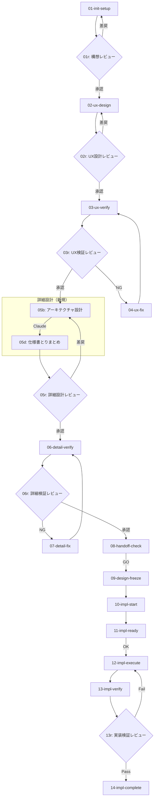
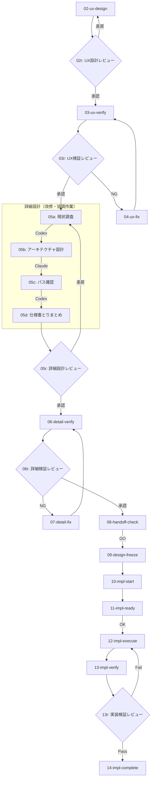

# 開発フロー プロンプト集

**作成日**: 2026-01-31
**目的**: 契約指向開発の各フェーズで使用する汎用プロンプト

---

## フロー概要

### 新規開発フロー

新規開発時は既存コードがないため、05a（現状調査）と05c（パス確認）はスキップ。
各AIフェーズの後に**人間レビューフェーズ**が存在する。



### 改修フロー

改修時は既存コードの把握が必須のため、4サブフェーズ全てを実施。
各AIフェーズの後に**人間レビューフェーズ**が存在する。



---

## プロンプト一覧

### 設計フェーズ

| ファイル | フェーズ | 用途 | 推奨ツール |
|----------|----------|------|------------|
| 01-init-setup.md | 構想検討 | 開発ルール・役割定義 | Claude |
| 02-ux-design.md | UX設計 | UX仕様策定（What） | Claude |
| 03-ux-verify.md | UX契約検証 | UX契約の検証 | Claude |
| 04-ux-fix.md | UX修正 | UX NG指摘の解消 | Claude |

### 詳細設計フェーズ

| ファイル | サブフェーズ | 用途 | 推奨ツール | 新規 | 改修 |
|----------|--------------|------|------------|:----:|:----:|
| 05a-detail-survey.md | 現状調査 | 既存実装の構造調査 | **Codex** | - | **○** |
| 05b-detail-architecture.md | アーキテクチャ設計 | レイヤー・モジュール設計 | **Claude** | ○ | ○ |
| 05c-detail-path-confirm.md | パス確認 | 実在確認・Before/After具体化 | **Codex** | - | **○** |
| 05d-detail-finalize.md | 仕様書とりまとめ | 最終仕様書作成 | **Claude** | ○ | ○ |
| 06-detail-verify.md | 詳細契約検証 | 詳細契約の検証 | Claude | ○ | ○ |
| 07-detail-fix.md | 詳細設計修正 | 詳細 NG指摘の解消 | Claude | ○ | ○ |

**凡例**: ○=使用 / -=スキップ（新規開発時は既存コードがないため05a, 05cは不要）

### 引継ぎフェーズ

| ファイル | フェーズ | 用途 | 推奨ツール |
|----------|----------|------|------------|
| 08-handoff-check.md | 実装引継ぎ判定 | 引継ぎ可否判定 | Claude |
| 09-design-freeze.md | 設計凍結 | 契約凍結・実装移行 | Claude |

### 実装フェーズ

| ファイル | フェーズ | 用途 | 推奨ツール |
|----------|----------|------|------------|
| 10-impl-start.md | 実装開始 | 実装モード有効化 | Codex |
| 11-impl-ready.md | 実装準備 | 仕様読み込み確認 | Codex |
| 12-impl-execute.md | 実装 | コード実装 | Codex |
| 13-impl-verify.md | 実装検証 | テスト・検証 | Codex |
| 14-impl-complete.md | 実装完了 | 完了確認 | Codex |

### 人間レビューフェーズ

各AIフェーズの後に人間によるレビューフェーズが存在する。

| ファイル | フェーズ | 用途 | 担当 |
|----------|----------|------|------|
| 01r-init-review.md | 構想レビュー | 構想検討成果物の確認・承認 | **人間+AI** |
| 02r-ux-review.md | UX設計レビュー | UX設計成果物の確認・承認 | **人間+AI** |
| 03r-ux-verify-review.md | UX検証レビュー | UX検証結果の確認・承認 | **人間+AI** |
| 05r-detail-review.md | 詳細設計レビュー | 詳細設計成果物の確認・承認 | **人間+AI** |
| 06r-detail-verify-review.md | 詳細検証レビュー | 詳細検証結果の確認・承認 | **人間+AI** |
| 13r-impl-verify-review.md | 実装検証レビュー | 実装検証結果の確認・承認 | **人間+AI** |

#### レビューフロー

```
[レビュー開始]
    ↓
AIが成果物サマリ提示
    ↓
┌─────────────────────────────┐
│ 項目ごとのレビューループ     │
│   AI: 項目Nのレビュー依頼    │
│   人間: レビュー・指摘/承認  │
│   [指摘] → AI: 対応案提示    │
│         → 人間: 選択/承認/棄却│
│   [承認] → 成果物反映        │
│   → 次の項目へ               │
└─────────────────────────────┘
    ↓
全項目完了
    ↓
人間: 次ステップ進行 or 再レビュー
```

---

## UX設計と詳細設計の違い

| 項目 | UX設計 | 詳細設計 |
|------|--------|----------|
| 定義するもの | **What**（何を作るか） | **How**（どう実現するか） |
| 画面構成 | ○ | - |
| 操作フロー | ○ | - |
| 表示仕様 | ○ | - |
| データ形式 | - | ○ |
| ファイル構造 | - | ○ |
| API仕様 | - | ○ |
| Before/After | - | ○ |

**詳細設計がないと、実装担当が独自解釈して設計意図と乖離する。**

---

## 使用方法

### 1. プロジェクト固有情報の置換

各プロンプト内の `{{変数}}` をプロジェクト固有の値に置換する。

| 変数 | 説明 | 例 |
|------|------|-----|
| `{{PROJECT_NAME}}` | プロジェクト名 | MyWebApp |
| `{{UX_SPEC_DIR}}` | UX仕様書ディレクトリ | docs/ux |
| `{{DETAIL_SPEC_DIR}}` | 詳細仕様書ディレクトリ | docs/detail |
| `{{IMPL_DIR}}` | 実装ディレクトリ | src |
| `{{DESIGN_ROLE}}` | 設計担当名 | Claude |
| `{{IMPL_ROLE}}` | 実装担当名 | Codex |

### 2. フェーズ順に実行

#### 新規開発時
1. 構想検討（01） → **人間レビュー（01r）**
2. UX設計（02） → **人間レビュー（02r）**
3. UX検証（03） → **人間レビュー（03r）** → UX修正（04）※NGの場合
4. 詳細設計・検証
   - 05b: Claude（アーキテクチャ設計）
   - 05d: Claude（仕様書とりまとめ）
   - **人間レビュー（05r）**
   - 06: Claude（検証）
   - **人間レビュー（06r）**
   - 07: 修正 ※NGの場合
5. 実装引継ぎ判定（08）
6. 設計凍結（09）
7. 実装（10-12）
8. 実装検証（13） → **人間レビュー（13r）** → 完了（14）

#### 改修時（協調作業）
1. UX設計変更（02） → **人間レビュー（02r）**
2. UX検証（03） → **人間レビュー（03r）** → UX修正（04）※NGの場合
3. 詳細設計・検証（**全サブフェーズ実施**）
   - 05a: Codex（現状調査）← **必須**
   - 05b: Claude（アーキテクチャ設計）
   - 05c: Codex（パス確認）← **必須**
   - 05d: Claude（仕様書とりまとめ）
   - **人間レビュー（05r）**
   - 06: Claude（検証）
   - **人間レビュー（06r）**
   - 07: 修正 ※NGの場合
4. 実装引継ぎ判定（08）
5. 設計凍結（09）
6. 実装（10-12）
7. 実装検証（13） → **人間レビュー（13r）** → 完了（14）

### 3. 差し戻し時

| 問題発見フェーズ | 差し戻し先（新規） | 差し戻し先（改修） |
|------------------|--------------------|--------------------|
| 詳細契約検証でNG（詳細問題） | 07-detail-fix.md | 07-detail-fix.md |
| 詳細契約検証でNG（UX問題） | 02-ux-design.md | 02-ux-design.md |
| 実装検証で設計問題発見 | 05b-detail-architecture.md | 05a-detail-survey.md |
| 実装検証でUX問題発見 | 02-ux-design.md | 02-ux-design.md |

---

## 改訂履歴

| 日付 | 内容 |
|------|------|
| 2026-01-31 | 初版作成 |
| 2026-01-31 | 詳細設計フェーズ追加（05-07）、番号体系変更 |
| 2026-01-31 | 詳細設計を4サブフェーズに分割（05a-05d）、推奨ツール追加 |
| 2026-01-31 | 新規開発/改修でフロー分離、使用プロンプト明確化 |
| 2026-02-02 | 人間レビューフェーズ追加（01r, 02r, 03r, 05r, 06r, 13r） |
